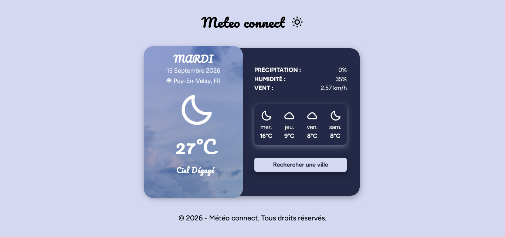

## 🌤️ METEO CONNECT : APPLICATION METEO 5 JOURS



## 🚀 Le challenge

Météo connect est une application simple et intuitive qui permet de consulter les prévisions météorologiques en temps réel et sur les 4 prochains jours pour n'importe quelle ville du monde.

Cette application dispose de plusieurs fonctionnalités :

- Météo en direct : Affichage de la température actuelle, des conditions (soleil, pluie, nuages), de la vitesse du vent et du taux d'humidité.
- Prévisions sur 4 jours : Tendances claires pour planifier votre semaine.
- Recherche par ville : Bouton permettant d'effectuer une recherche
- Design adaptatif : Une interface moderne qui s'adapte parfaitement aux ordinateurs, tablettes et smartphones.

## 📸 Démonstration

Lien vers le projet : https://aperbet56.github.io/meteo_connect/

## 🛠️ Projet développé avec

- Utlisation des balises sémantiques HTML5
- CSS3
- Flexbox
- Animations CSS (transition, @keyframes)
- Créaion d'un loader
- Position absolute, relative et fixed
- Importation du normaliseur : le fichier normalize.css
- Desktop first
- Page web responsive
- Importation des polices "Pacifico" et "Figtree"
- Importation de Boxicons pour les icônes
- Commentaires HTML
- Commentaires CSS
- API Météo: [OpenWeatherMap](https://openweathermap.org)
- JavaScript
- Code JavaScript commenté
- addEventListener
- async/await
- fetch

## 📂 Structure du projet

```text
├── index.html          # Structure HTML5 sémantique
├── style.css           # Style de l'application météo
└── script.js           # Logique JavaScript avec récupération des données de l'API
```

---

## 📝 Licence

Projet libre de droits. Vous pouvez l'utiliser, le modifier et le distribuer selon vos besoins professionnels ou éducatifs.
